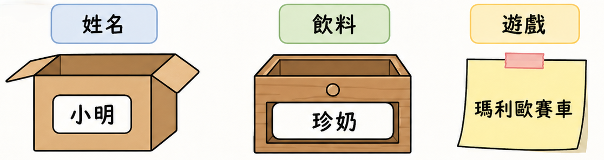
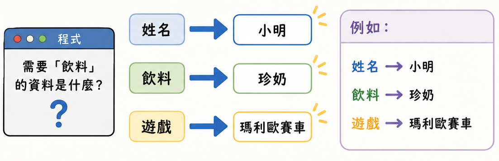
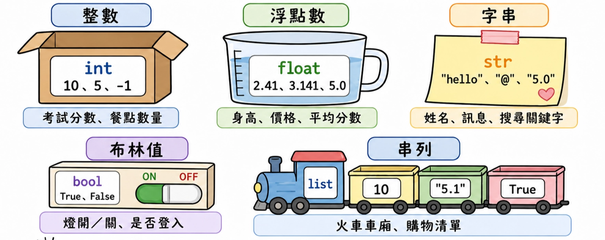

# Lesson 2 и®Љж•ё Variable

## 課前暖身：自我介紹

請先用 3 句話介紹自己，例如：姓名、喜歡的飲料、最近常玩的遊戲。

等一下我們會把這些資料想成可以放進程式「箱子」裡的內容。

## Section I：什麼是變數

變數可以想像成一個箱子、抽屜或便條紙。箱子外面有名字，箱子裡面可以放資料。

程式需要資料時，就可以用箱子的名字把資料拿出來。



在 Python 中，建立變數的方法是：`變數名稱 = 值`。

等號左邊是箱子的名字，右邊是要放進去的資料。

```python
variable_name = value

# дѕ‹пјљ
x = 10
```



### зЇ„дѕ‹ Exпјљж•ёе­—и®Љж•ё

е®љзѕ©дёЂеЂ‹и®Љж•ё `x`пјЊеЂјз‚є `10`пјЊијёе‡є `x` еЉ  `10` зљ„зµђжћњгЂ‚

```python
x = 10 # е®љзѕ©и®Љж•ё x зљ„еЂјз‚є 10
print(x + 10) # ијёе‡є x еЉ дёЉ 10 зљ„зµђжћњ
```

生活化理解：`x` 像一張寫著「10」的便條紙。

當程式看到 `x + 10`，就會把 `x` 代表的 `10` 拿出來計算，所以結果是 `20`。

### зЇ„дѕ‹ Ex.4пјљж–‡е­—и®Љж•ё

變數除了可以放數字，也可以放文字。文字要放在引號中。

```python
x = 'Hello'
print(x)
```

生活化理解：飲料店點餐機可能把 `drink = "珍珠奶茶"` 存起來，等結帳時再印出品項。

## Section IIпјљи®Љж•ёећ‹ж…‹ Data Type

變數裡可以放很多種資料。資料的種類稱為資料型態，也就是 Data Type。

不同型態可以做的事情不一樣，就像水杯、便當盒、鉛筆盒都能裝東西，但適合裝的內容不同。



| 型態 | Python 名稱 | 例子 | 生活化想像 |
| --- | --- | --- | --- |
| 整數 | `int` | `10`, `5`, `-1` | 考試分數、餐點數量 |
| 浮點數 | `float` | `2.41`, `3.141`, `5.0` | 身高、價格、平均分數 |
| 字串 | `str` | `'hello'`, `'@'`, `'5.0'` | 姓名、訊息、搜尋關鍵字 |
| 布林值 | `bool` | `True`, `False` | 燈開/關、是否登入 |
| 串列 | `list` | `[10, "5.1", True]` | 火車車廂、購物清單 |

### 1. ж•ёе­— Numbers

ж•ґж•ё IntegerпјљжІ’жњ‰е°Џж•ёй»ћзљ„ж•ёпјЊPython з°ЎеЇ«з‚є `int`гЂ‚

```python
x = 10
y = 5
z = -1
```

жµ®й»ћж•ё FloatпјљеЏЄи¦Ѓеђ«жњ‰е°Џж•ёй»ћпјЊе°±зЁ±з‚є `float`гЂ‚

即使是 `5.0`，小數點後面是 `0`，也仍然是浮點數。

```python
x = 2.41
y = 3.141
z = 5.0 # 注意！小數點後為 0 依然是浮點數
```

### 2. ж–‡е­— String

字串 String：只要資料放在引號中，Python 就會把它當成字串，簡寫為 `str`。

字串可以是文字、數字或符號。

```python
x = 'hello'
y = '@'
z = '5.0' # 注意！'5.0' 在引號中，所以仍然是字串
```

提醒：`5.0` 和 `"5.0"` 看起來很像，但前者是可以計算的小數，後者是文字。

### 3. еёѓжћ—еЂј Boolean

布林值只有 `True` 和 `False`，常用來表示是/否、開/關、有/沒有。

Python з°ЎеЇ«з‚є `bool`гЂ‚

```python
x = True
y = False
```

生活化例子：`is_logged_in = True` 代表使用者已登入；`has_homework = False` 代表沒有作業。

### 4. дёІе€— List

дёІе€—еѓЏдёЂе€—зЃ«и»ЉпјЊжњ‰еѕ€е¤љи»Ље»‚гЂ‚

每個車廂都可以放不同資料，例如數字、文字、布林值。

建立串列時使用中括號 `[]`，資料之間用逗號隔開。

```python
list1 = [v1, v2, v3, ...]
```

### зЇ„дѕ‹ Ex.5пјљжЉЉдёЌеђЊећ‹ж…‹ж”ѕйЂІдёІе€—

```python
x = 10
y = '5.1'
z = True
l = [x, y, z]

print(x)
print(y)
print(z)
print(l)
```

生活化理解：這像一張自我介紹卡，可以同時放年齡、名字、是否喜歡打球等不同資料。

## ж–·и®Љж•ёећ‹ж…‹пјљtype(data)

如果不確定某筆資料是什麼型態，可以使用 `type()`。

它像是幫資料做「身分檢查」。

### 範例 Ex.6：檢查 Ex.5 中的型態

```python
x = 10
y = '5.1'
z = True
l = [x, y, z]

print(type(x))
print(type(y))
print(type(z))
print(type(l))
```

## и®Љж•ёећ‹ж…‹иЅ‰жЏ›

有時候資料看起來像數字，但其實是字串，例如使用者輸入的 `"100"`。

如果要拿來計算，就需要轉換型態。

```python
int()   # иЅ‰ж•ґж•ё
float() # иЅ‰з‚єжµ®й»ћж•ё
str()   # иЅ‰з‚єе­—дёІ
bool()  # иЅ‰з‚єеёѓжћ—еЂј
list()  # иЅ‰з‚єдёІе€—
```

дѕ‹е­ђпјљ

飲料店點餐機讀到的數量可能一開始是文字 `"2"`，要計算總價前，要先用 `int("2")` 轉成整數 `2`。

```python
price = 60
count = '2'
total = price * int(count)
print(total)
```

## 常見錯誤

- 忘記引號：`Hello` 沒有引號會被當成變數名稱；要寫成 `"Hello"` 或 `'Hello'`。
- 把字串當數字計算：`"5" + 1` 會出錯，因為 `"5"` 是文字。
- 以為 `5.0` 是 `int`：只要有小數點，就是 `float`。
- `True` / `False` 大小寫錯誤：Python 要寫 `True`、`False`，不能寫 `true`、`false`。
- `list` 少逗號：串列中的資料要用逗號分開，例如 `[10, "5.1", True]`。

## 重點複習

- 變數像容器，可以用名稱保存資料。
- 建立變數的格式是：`變數名稱 = 值`。
- `int` 是整數，`float` 是小數，`str` 是字串，`bool` 是 `True`/`False`，`list` 是串列。
- 只要資料放在引號中，就是字串。
- `type()` 可以檢查資料型態。
- `int()`、`float()`、`str()`、`bool()`、`list()` 可以做基本型態轉換。

## иЄІеѕЊз·ґзї’

1. е»єз«‹ `name` и®Љж•ёпјЊж”ѕе…Ґи‡Єе·±зљ„и‹±ж–‡еђЌе­—пјЊдё¦еЌ°е‡єдѕ†гЂ‚
2. 建立 `age` 變數，放入自己的年齡，並印出 `age + 1`。
3. е»єз«‹ `price = 45`гЂЃ`count = "3"`пјЊжЉЉ `count` иЅ‰ж€ђж•ґж•ёеѕЊиЁ€з®—зёЅеѓ№гЂ‚
4. 建立一個串列 `intro`，放入姓名、年齡、是否喜歡 Python，並印出 `intro`。
5. 使用 `type()` 檢查 `10`、`10.0`、`"10"`、`True`、`[10]` 的型態。

---
