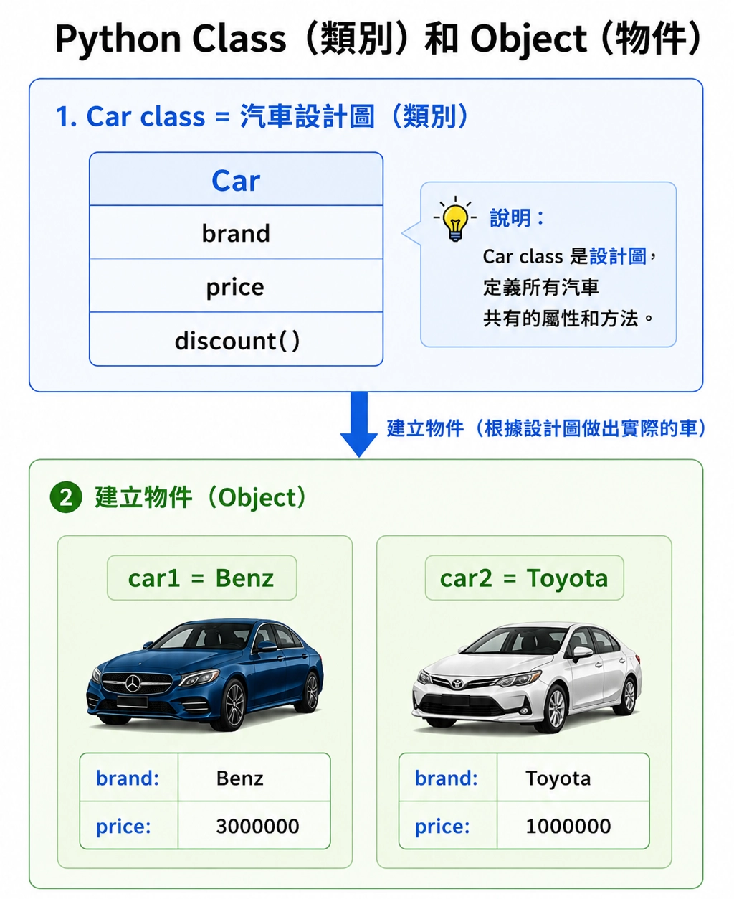
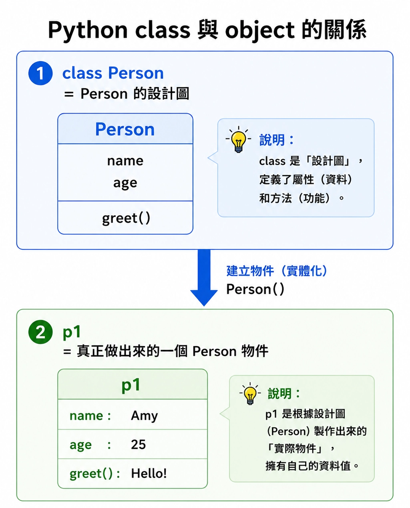
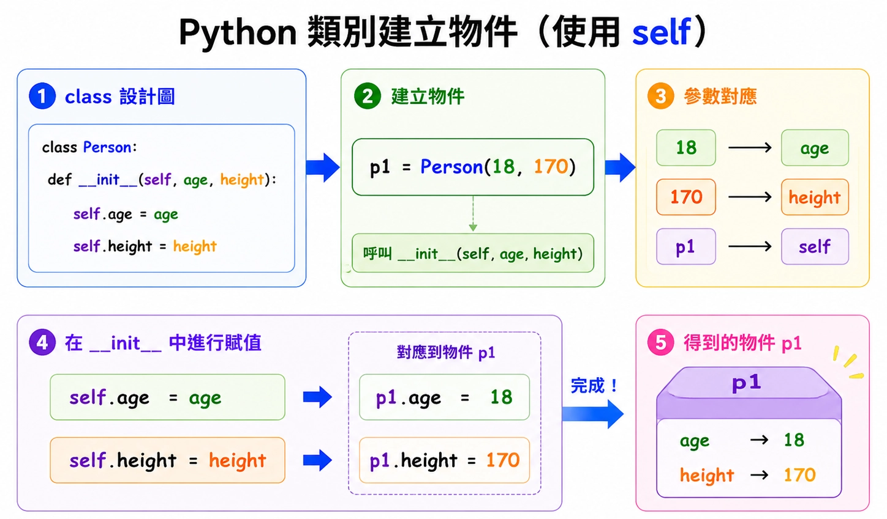
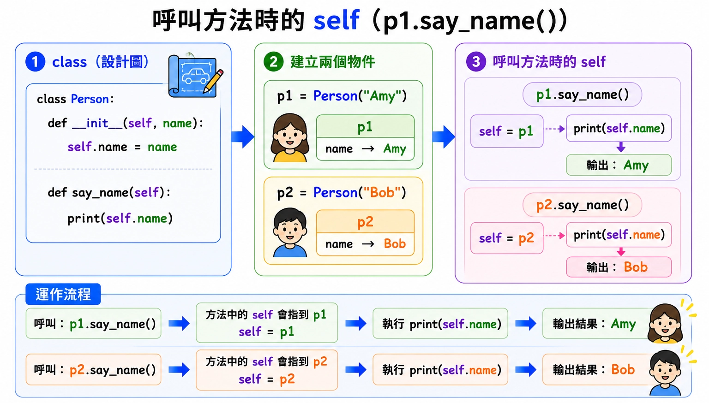
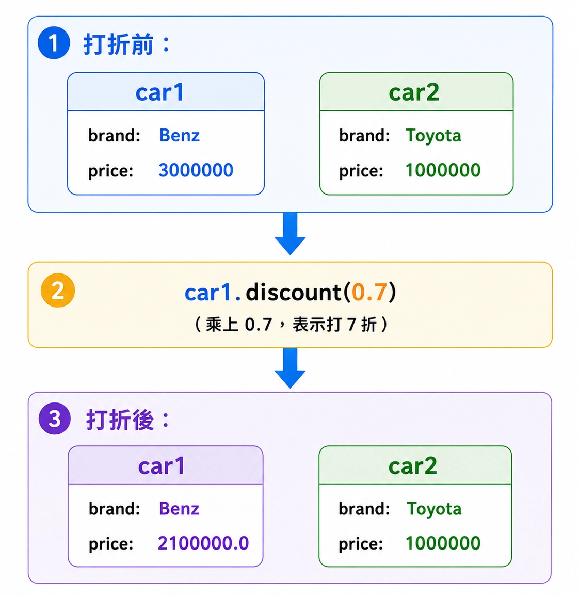
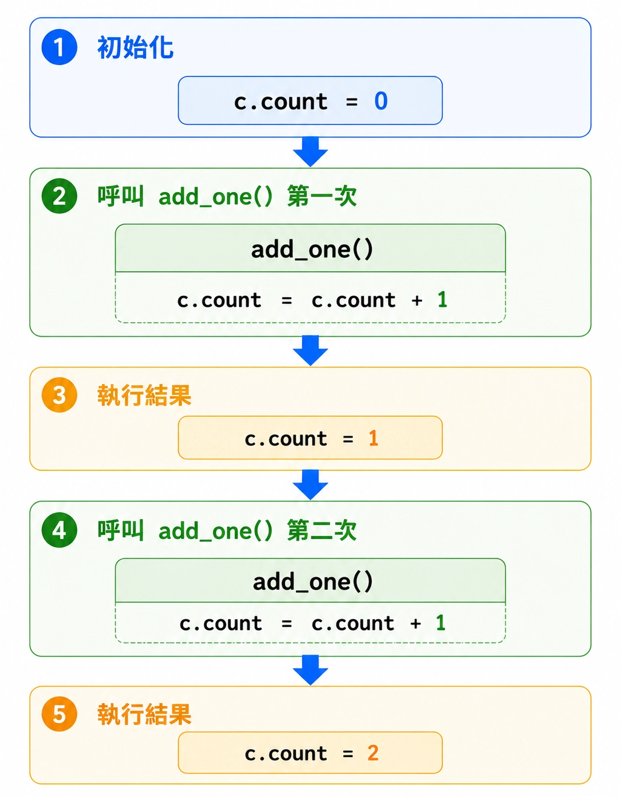
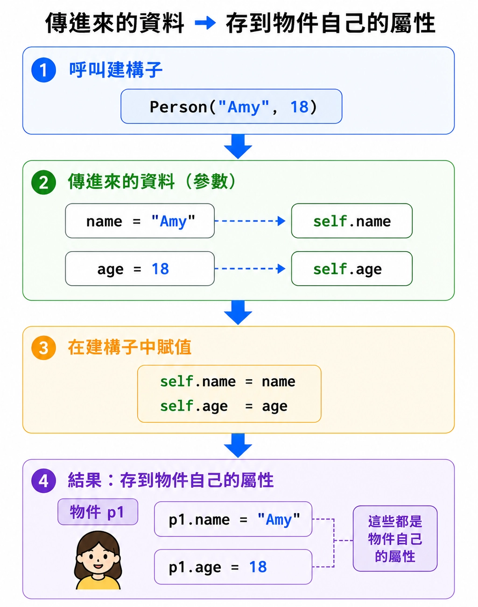
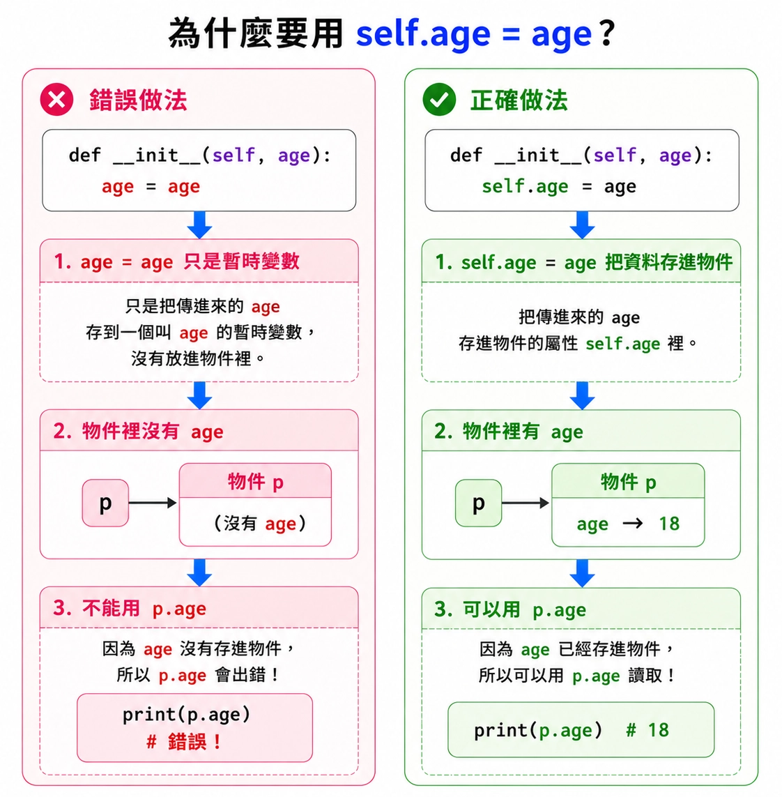

# Lesson 11: 物件 Object 與類別 Class

物件（object）與類別（class）常出現在比較大的程式、遊戲角色設計、資料管理、GUI 程式、模組與函式庫中。

> 這堂課的重點：理解 class 是設計圖，object 是根據設計圖做出來的實體。
> 

---

## Section I. 今天要做什麼？

1. 認識什麼是物件（object）。
2. 認識什麼是類別（class）。
3. 理解屬性（attribute）和方法（method）。
4. 學會使用 `class` 建立自己的類別。
5. 學會使用 `__init__()` 設定初始資料。
6. 理解 `self` 代表物件自己。
7. 練習建立物件並讀取、修改物件屬性。

---

## Section II. 今天的學習方式

物件導向程式設計一開始會比較抽象，所以可以先用生活中的例子理解。

<p align="center">
  
</p>

例如：

```
Class：汽車設計圖
Object：真正做出來的一台車
Attribute：車子的品牌、價格、顏色
Method：車子可以做的動作，例如加速、煞車、打折
```

不用一開始就完全理解所有細節，先做到：

1. 看得懂 `class` 的基本結構。
2. 知道 `__init__()` 是用來設定初始資料。
3. 知道 `self.name` 是物件自己的資料。
4. 可以建立一個簡單物件。
5. 可以呼叫物件的方法。

---

## Section III. 今天會學到的內容

| 主題 | 你需要知道的事 |
| --- | --- |
| object | 根據 class 建立出來的實體 |
| class | 用來描述物件有哪些資料和功能的設計圖 |
| attribute | 物件擁有的資料，例如年齡、身高 |
| method | 物件可以執行的函式 |
| `__init__()` | 建立物件時自動執行的初始化函式 |
| `self` | 代表目前這個物件自己 |
| built-in class | Python 內建的類別，例如 `int`、`str`、`list` |

---

## Section IV. 寫題目前的提醒

### 1. 先分清楚 class 和 object

<p align="center">
  
</p>

`class` 是設計圖，不是真正的物件。

```python
class Person:
    pass
```

這只是定義一種叫做 `Person` 的類別。

要建立物件，需要這樣寫：

```python
p1 = Person()
```

這時候 `p1` 才是一個真正可以使用的物件。

---

### 2. 物件可以有自己的屬性

```python
class Person:
    def __init__(self, age, height):
        self.age = age
        self.height = height

p1 = Person(18, 170)

print(p1.age)
print(p1.height)
```

Result:

```
18
170
```

`p1.age` 的意思是：取得 `p1` 這個物件自己的 `age`。

---

### 3. `self` 通常一定要寫

在 class 裡面寫方法時，第一個參數通常要寫 `self`。

```python
class Person:
    def birthday(self):
        print("Happy birthday")
```

呼叫時不用自己傳入 `self`：

```python
p1 = Person()
p1.birthday()
```

Python 會自動把 `p1` 當作 `self` 傳進去。

---

### 4. 字串資料要加引號

Wrong:

```python
car1 = Car(benz, 3000000)
```

如果 `benz` 是文字，應該加引號。

Correct:

```python
car1 = Car("Benz", 3000000)
```

---

## Section V. 核心概念說明

### 1. 什麼是物件 object？

物件可以想像成生活中的一個實體。

例如一個人可以有：

```
年齡 age
身高 height
名字 name
```

在 Python 中，我們可以用物件來表示這些資料。

```python
class Person:
    def __init__(self, age, height):
        self.age = age
        self.height = height

p1 = Person(18, 170)

print(p1.age)
print(p1.height)
```

Result:

```
18
170
```

這裡的 `p1` 就是一個物件。

---

### 2. 什麼是類別 class？

類別（class）可以想成物件的設計圖。

```python
class Person:
    def __init__(self, age, height):
        self.age = age
        self.height = height
```

這段程式定義了 `Person` 這種資料型態。

它告訴 Python：

```
一個 Person 物件會有 age 和 height 這兩個屬性。
```

---

### 3. 建立物件

定義 class 後，可以用 class 產生物件。

```python
class Person:
    def __init__(self, age, height):
        self.age = age
        self.height = height

p1 = Person(18, 170)
p2 = Person(20, 180)

print(p1.age)
print(p2.age)
```

Result:

```
18
20
```

`p1` 和 `p2` 都是 `Person` 物件，但它們可以有不同的資料。

---

### 4. `__init__()` 初始化函式

<p align="center">
  
</p>

`__init__()` 是建立物件時自動執行的函式。

```python
class Person:
    def __init__(self, age, height):
        self.age = age
        self.height = height
```

當我們寫：

```python
p1 = Person(18, 170)
```

Python 會自動呼叫：

```
__init__(p1, 18, 170)
```

其中：

| 程式 | 意義 |
| --- | --- |
| `self` | 目前這個物件自己 |
| `age` | 建立物件時傳入的年齡 |
| `height` | 建立物件時傳入的身高 |
| `self.age = age` | 把 age 存到物件自己的 age 屬性 |
| `self.height = height` | 把 height 存到物件自己的 height 屬性 |

---

### 5. 什麼是屬性 attribute？

屬性就是物件擁有的資料。

```python
class Person:
    def __init__(self, name, age):
        self.name = name
        self.age = age

p1 = Person("Amy", 18)

print(p1.name)
print(p1.age)
```

Result:

```
Amy
18
```

這裡的 `name` 和 `age` 都是 `p1` 的屬性。

---

### 6. 什麼是方法 method？

方法就是寫在 class 裡面的函式。

```python
class Person:
    def __init__(self, age):
        self.age = age

    def birthday(self):
        self.age += 1

p1 = Person(18)
p1.birthday()

print(p1.age)
```

Result:

```
19
```

`birthday()` 是 `Person` 物件可以執行的方法。

它會讓這個人的年齡增加 1。

---

### 7. `self` 是什麼？

<p align="center">
  
</p>

`self` 代表「目前這個物件自己」。

```python
class Person:
    def __init__(self, name):
        self.name = name

    def say_name(self):
        print(self.name)

p1 = Person("Amy")
p2 = Person("Bob")

p1.say_name()
p2.say_name()
```

Result:

```
Amy
Bob
```

同一個方法 `say_name()`，對不同物件呼叫時，`self` 會代表不同物件。

```
p1.say_name() 時，self 是 p1
p2.say_name() 時，self 是 p2
```

---

### 8. Python 內建類別 built-in classes

之前我們學過資料型態，例如：

```python
print(type(123))
print(type(3.14))
print(type("hello"))
print(type(True))
```

Result:

```
<class 'int'>
<class 'float'>
<class 'str'>
<class 'bool'>
```

這代表 Python 中的資料型態其實也是類別。

---

### 9. 常見內建類別

| 類別 | 說明 |
| --- | --- |
| `int` | 整數，例如 `123` |
| `float` | 浮點數，例如 `3.14` |
| `str` | 字串，例如 `"hello"` |
| `bool` | 布林值，`True` 或 `False` |
| `list` | 串列，可以修改內容 |
| `tuple` | 元組，內容通常不能修改 |
| `dict` | 字典，使用 key 對應 value |

Example:

```python
data = [1, 2, 3]

print(type(data))
```

Result:

```
<class 'list'>
```

所以 `list` 其實也是一種類別。

---

### 10. 自訂類別：Car

我們可以自己建立一個 `Car` 類別。

```python
class Car:
    def __init__(self, brand, price):
        self.brand = brand
        self.price = price

car1 = Car("Benz", 3000000)

print(car1.brand)
print(car1.price)
```

Result:

```
Benz
3000000
```

這裡：

| 程式 | 意義 |
| --- | --- |
| `class Car:` | 建立 Car 類別 |
| `brand` | 建立車子時傳入的品牌 |
| `price` | 建立車子時傳入的價格 |
| `self.brand` | 這台車自己的品牌 |
| `self.price` | 這台車自己的價格 |
| `car1` | 根據 Car 類別建立的物件 |

---

### 11. 在 class 中加入方法

可以幫 `Car` 加上打折功能。

```python
class Car:
    def __init__(self, brand, price):
        self.brand = brand
        self.price = price

    def discount(self, rate):
        self.price *= rate

car1 = Car("Benz", 3000000)
car1.discount(0.7)

print(car1.price)
```

Result:

```
2100000.0
```

`discount(0.7)` 代表價格乘上 `0.7`，也就是打七折。

---

### 12. 多個物件互不影響

<p align="center">
  
</p>

同一個 class 可以建立很多不同物件。

```python
class Car:
    def __init__(self, brand, price):
        self.brand = brand
        self.price = price

    def discount(self, rate):
        self.price *= rate

car1 = Car("Benz", 3000000)
car2 = Car("Toyota", 1000000)

car1.discount(0.7)

print(car1.price)
print(car2.price)
```

Result:

```
2100000.0
1000000
```

`car1` 打折不會影響 `car2`，因為它們是不同物件。

---

## Section VI. 快速概念檢查

<p align="center">
  
</p>

請先不要急著執行，先用眼睛看，猜猜看答案。

### Q1. 讀取物件屬性

```python
class Person:
    def __init__(self, age):
        self.age = age

p1 = Person(18)
print(p1.age)
```

Question:
你覺得結果會是什麼？

Answer:

```
18
```

Explanation:
`p1` 建立時傳入 `18`，所以 `p1.age` 是 `18`。

---

### Q2. 方法修改屬性

```python
class Person:
    def __init__(self, age):
        self.age = age

    def birthday(self):
        self.age += 1

p1 = Person(20)
p1.birthday()
print(p1.age)
```

Question:
你覺得結果會是什麼？

Answer:

```
21
```

Explanation:
`birthday()` 會讓 `self.age` 增加 1。

---

### Q3. 多個物件

```python
class Student:
    def __init__(self, score):
        self.score = score

s1 = Student(90)
s2 = Student(75)

print(s1.score)
print(s2.score)
```

Question:
你覺得結果會是什麼？

Answer:

```
90
75
```

Explanation:
`s1` 和 `s2` 是不同物件，所以可以有不同分數。

---

### Q4. type 的結果

```python
x = "hello"
print(type(x))
```

Question:
你覺得結果會是什麼？

Answer:

```
<class 'str'>
```

Explanation:
`"hello"` 是字串，所以它的類別是 `str`。

---

### Q5. 打折方法

```python
class Product:
    def __init__(self, price):
        self.price = price

    def discount(self, rate):
        self.price *= rate

p = Product(100)
p.discount(0.8)

print(p.price)
```

Question:
你覺得結果會是什麼？

Answer:

```
80.0
```

Explanation:
`100 * 0.8 = 80.0`。

---

## Section VII. 程式閱讀練習

### 題目 1：建立物件

```python
class Dog:
    def __init__(self, name):
        self.name = name

dog1 = Dog("Lucky")
print(dog1.name)
```

思考方式：

```
Dog("Lucky") 會建立一個 Dog 物件。
self.name = name 會把 "Lucky" 存到 dog1.name。
```

所以答案是：

```
Lucky
```

---

### 題目 2：方法改變屬性

```python
class Counter:
    def __init__(self):
        self.count = 0

    def add_one(self):
        self.count += 1

c = Counter()
c.add_one()
c.add_one()

print(c.count)
```

思考方式：

```
一開始 count 是 0。
第一次 add_one() 後 count 變成 1。
第二次 add_one() 後 count 變成 2。
```

所以答案是：

```
2
```

---

### 題目 3：兩個物件不同資料

```python
class Box:
    def __init__(self, value):
        self.value = value

b1 = Box(10)
b2 = Box(20)

b1.value = 100

print(b1.value)
print(b2.value)
```

思考方式：

```
b1 和 b2 是不同物件。
b1.value 改成 100，不會影響 b2.value。
```

所以答案是：

```
100
20
```

---

### 題目 4：方法中的參數

```python
class BankAccount:
    def __init__(self, money):
        self.money = money

    def deposit(self, amount):
        self.money += amount

account = BankAccount(1000)
account.deposit(500)

print(account.money)
```

思考方式：

```
一開始 money 是 1000。
deposit(500) 會讓 money 增加 500。
```

所以答案是：

```
1500
```

---

### 題目 5：class 與 type

```python
class Cat:
    pass

cat1 = Cat()

print(type(cat1))
```

思考方式：

```
cat1 是根據 Cat 類別建立的物件。
所以 type(cat1) 會顯示它屬於 Cat。
```

所以答案類似：

```
<class '__main__.Cat'>
```

---

## Section VIII. 實作練習 / 實作檢測題

<p align="center">
  
</p>

請完成下面類別。這一區不提供完整解答，請先自己試著寫。

### Q1. 建立 Person 類別

完成類別：

```python
class Person:
    def __init__(self, name, age):
        #TODO: 設定 self.name
        #TODO: 設定 self.age
        pass
```

Example:

```python
p = Person("Amy", 18)
print(p.name)
print(p.age)
```

應該輸出：

```
Amy
18
```

---

### Q2. 建立 Student 類別

完成類別：

```python
class Student:
    def __init__(self, name, score):
        #TODO: 設定學生姓名和分數
        pass
```

Example:

```python
s = Student("Bob", 90)
print(s.name)
print(s.score)
```

應該輸出：

```
Bob
90
```

---

### Q3. 加上生日方法

完成類別：

```python
class Person:
    def __init__(self, age):
        #TODO: 設定 self.age
        pass

    def birthday(self):
        #TODO: 讓 age 增加 1
        pass
```

Example:

```python
p = Person(18)
p.birthday()
print(p.age)
```

應該輸出：

```
19
```

---

### Q4. 建立 Product 類別

完成類別：

```python
class Product:
    def __init__(self, name, price):
        #TODO: 設定商品名稱和價格
        pass

    def discount(self, rate):
        #TODO: 讓 price 乘上 rate
        pass
```

Example:

```python
p = Product("Pen", 100)
p.discount(0.8)
print(p.price)
```

應該輸出：

```
80.0
```

---

### Q5. 建立 Counter 類別

完成類別：

```python
class Counter:
    def __init__(self):
        #TODO: 設定 self.count = 0
        pass

    def add_one(self):
        #TODO: 讓 count 增加 1
        pass
```

Example:

```python
c = Counter()
c.add_one()
c.add_one()
print(c.count)
```

應該輸出：

```
2
```

---

### Q6. 建立 BankAccount 類別

完成類別：

```python
class BankAccount:
    def __init__(self, money):
        #TODO: 設定 self.money
        pass

    def deposit(self, amount):
        #TODO: 存錢，讓 money 增加 amount
        pass

    def withdraw(self, amount):
        #TODO: 領錢，讓 money 減少 amount
        pass
```

Example:

```python
account = BankAccount(1000)
account.deposit(500)
account.withdraw(200)
print(account.money)
```

應該輸出：

```
1300
```

---

### Q7. 建立 Rectangle 類別

完成類別：

```python
class Rectangle:
    def __init__(self, width, height):
        #TODO: 設定寬和高
        pass

    def area(self):
        #TODO: 回傳面積
        return None
```

Example:

```python
r = Rectangle(3, 4)
print(r.area())
```

應該輸出：

```
12
```

---

### Q8. 建立 Car 類別

完成類別：

```python
class Car:
    def __init__(self, brand, price):
        #TODO: 設定品牌和價格
        pass

    def discount(self, rate):
        #TODO: 讓價格乘上 rate
        pass
```

Example:

```python
car = Car("Benz", 3000000)
car.discount(0.7)
print(car.price)
```

應該輸出：

```
2100000.0
```

---

## Section IX. 做題時可以使用的提示

### 1. class 基本格式

```python
class ClassName:
    pass
```

自訂類別名稱通常使用大寫開頭。

---

### 2. `__init__()` 基本格式

```python
class Person:
    def __init__(self, name):
        self.name = name
```

`__init__()` 會在建立物件時自動執行。

---

### 3. 建立物件

```python
p1 = Person("Amy")
```

這會根據 `Person` 類別建立一個物件。

---

### 4. 讀取屬性

```python
p1.name
```

物件名稱後面接 `.屬性名稱`。

---

### 5. 修改屬性

```python
p1.age = 20
```

可以直接修改物件的屬性。

---

### 6. 建立方法

```python
class Counter:
    def add_one(self):
        self.count += 1
```

方法通常要有 `self`，才能讀取或修改物件自己的屬性。

---

### 7. 呼叫方法

```python
c.add_one()
```

呼叫方法時，不需要自己把 `self` 傳進去。

---

### 8. 方法可以回傳資料

```python
class Rectangle:
    def area(self):
        return self.width * self.height
```

如果方法要交回計算結果，可以使用 `return`。

---

## Section X. 課後小練習

### 練習 1：Book 類別

寫一個類別：

```python
class Book:
    def __init__(self, title, price):
        pass
```

請讓物件可以儲存書名和價格。

Example:

```python
book = Book("Python", 500)
print(book.title)
print(book.price)
```

應該輸出：

```
Python
500
```

---

### 練習 2：Score 類別

寫一個類別：

```python
class Score:
    def __init__(self, value):
        pass

    def add_bonus(self, bonus):
        pass
```

`add_bonus()` 會讓分數增加 `bonus`。

Example:

```python
s = Score(80)
s.add_bonus(5)
print(s.value)
```

應該輸出：

```
85
```

---

### 練習 3：Circle 類別

寫一個類別：

```python
class Circle:
    def __init__(self, radius):
        pass

    def area(self):
        return None
```

`area()` 回傳圓面積，圓周率可以先使用 `3.14`。

Example:

```python
c = Circle(10)
print(c.area())
```

應該輸出：

```
314.0
```

---

### 練習 4：GameCharacter 類別

寫一個類別：

```python
class GameCharacter:
    def __init__(self, name, hp):
        pass

    def hurt(self, damage):
        pass
```

`hurt(damage)` 會讓角色的 `hp` 減少 `damage`。

Example:

```python
g = GameCharacter("Hero", 100)
g.hurt(30)
print(g.hp)
```

應該輸出：

```
70
```

---

### 練習 5：Laptop 類別

寫一個類別：

```python
class Laptop:
    def __init__(self, brand, price):
        pass

    def change_price(self, new_price):
        pass
```

`change_price(new_price)` 會把價格改成 `new_price`。

Example:

```python
laptop = Laptop("Apple", 40000)
laptop.change_price(35000)
print(laptop.price)
```

應該輸出：

```
35000
```

---

## Section XI. 重點複習

| 重點 | 說明 |
| --- | --- |
| object | 根據 class 建立出來的實體 |
| class | 物件的設計圖 |
| attribute | 物件擁有的資料 |
| method | 寫在 class 裡面的函式 |
| `class ClassName:` | 建立類別 |
| `__init__()` | 初始化函式，建立物件時自動執行 |
| `self` | 代表目前這個物件自己 |
| `self.name = name` | 把資料存成物件屬性 |
| `object.attribute` | 讀取物件屬性 |
| `object.method()` | 呼叫物件方法 |

---

## Section XII. 常見錯誤提醒

<p align="center">
  
</p>

### 1. 忘記寫 `self`

Wrong:

```python
class Person:
    def __init__(age):
        age = age
```

這樣 Python 不知道哪個物件要存資料。

Correct:

```python
class Person:
    def __init__(self, age):
        self.age = age
```

---

### 2. 只寫 `age = age`，沒有存到物件裡

Wrong:

```python
class Person:
    def __init__(self, age):
        age = age
```

這樣沒有建立 `self.age`，之後無法用 `p.age` 讀取。

Correct:

```python
class Person:
    def __init__(self, age):
        self.age = age
```

---

### 3. 呼叫方法時自己傳入 `self`

Wrong:

```python
p = Person(18)
p.birthday(p)
```

呼叫物件方法時，Python 會自動傳入 `self`。

Correct:

```python
p = Person(18)
p.birthday()
```

---

### 4. 字串忘記加引號

Wrong:

```python
car = Car(Benz, 3000000)
```

如果 `Benz` 是文字，需要加引號。

Correct:

```python
car = Car("Benz", 3000000)
```

---

### 5. 忘記建立物件就直接用屬性

Wrong:

```python
print(Person.age)
```

通常我們要先建立物件，再讀取物件的屬性。

Correct:

```python
p = Person(18)
print(p.age)
```

---

### 6. class 裡面的程式沒有縮排

Wrong:

```python
class Person:
def __init__(self, age):
self.age = age
```

class 裡面的函式和函式裡面的程式都需要縮排。

Correct:

```python
class Person:
    def __init__(self, age):
        self.age = age
```

---

## Section XIII. 小提醒

物件導向可以幫助我們把資料和功能整理在一起。

例如：

```
學生 Student：name, score, update_score()
車子 Car：brand, price, discount()
銀行帳戶 BankAccount：money, deposit(), withdraw()
遊戲角色 GameCharacter：name, hp, hurt()
```

當你發現某個東西有「自己的資料」和「自己的行為」時，就可以考慮用 class 來設計它。

> class 是設計圖，object 是做出來的實體。
>